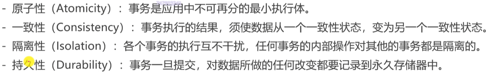
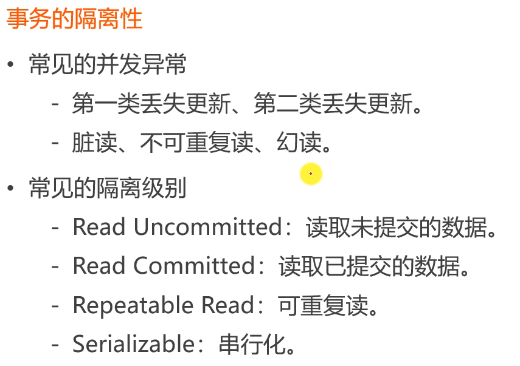
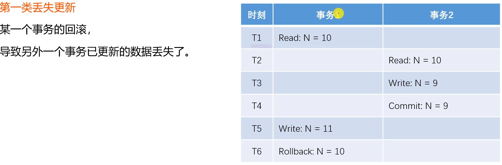
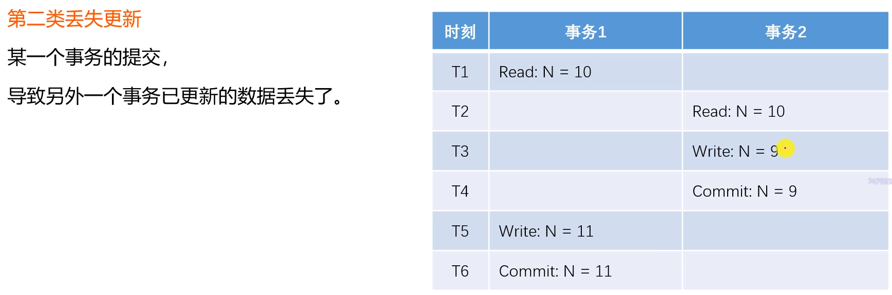
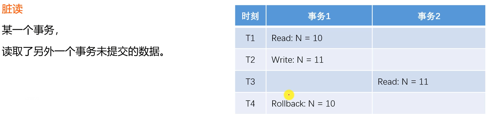
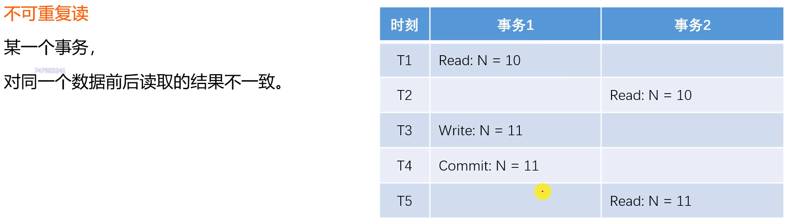
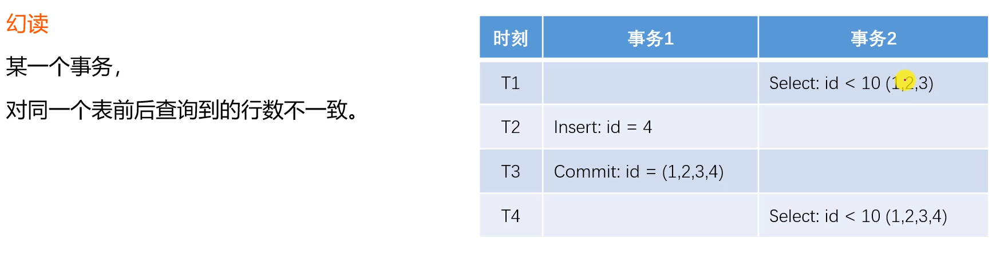
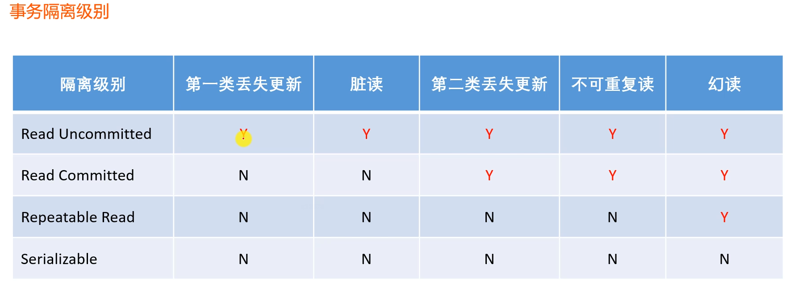
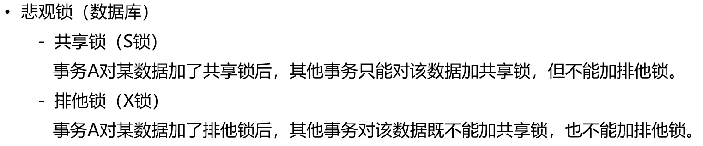

#事务
-事务是由N步数据库操作序列组成的逻辑执行单元，这系列操作要么全执行，要么全放弃

-事务的特性ACID：


## 事务的隔离性


### 第一类丢失更新

### 第二类丢失更新

### 脏读

### 不可重复读

### 幻读

## 事务隔离级别


## 悲观锁

## 乐观锁


## @Transactional

```java
import org.springframework.transaction.annotation.Propagation;
import org.springframework.transaction.annotation.Transactional;

// REQUIRED: 支持当前事务，如果不存在再创建新事务
// REQUIRED_NEW: 创建一个新事务，并且暂停当前事务
// NESTED: 如果当前存在事务，则嵌套在该事务中执行（独立的提交和回滚）,否则和REQUIRED一样

//@Transactional(isolation = Isolation.READ_COMMITED, propagation = Propagation.REQUIRED)
```
## 编程式事务

```java
import org.springframework.beans.factory.annotation.Autowired;

transactionTemplate.setIsolationLevel(TransactionDefinition.ISOLATION_READ_COMMITTED);
        transactionTemplate.setPropagationBehavior(TransactionDefinition.PROPAGATION_REQUIRED);

        return transactionTemplate.execute(new TransactionCallback<Object>() {
@Override
public Object doInTransaction(TransactionStatus status) {
        // 这里是需要做的业务
        return "ok";
        }
        })
```